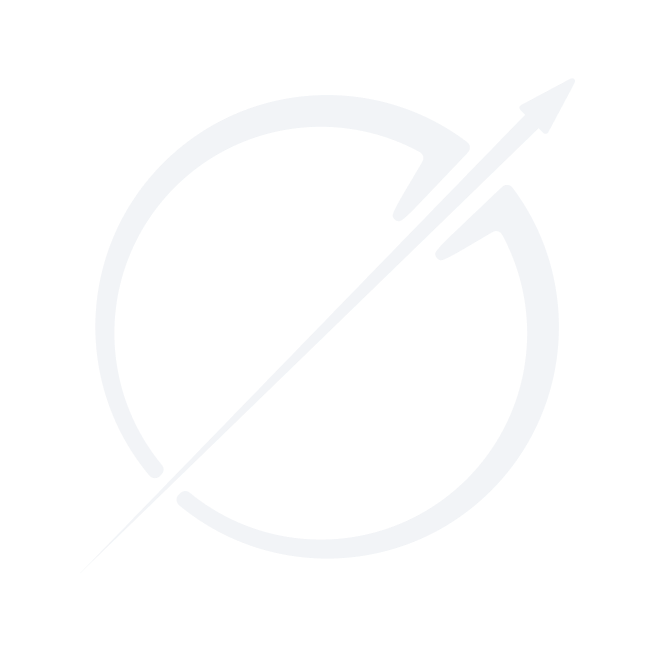
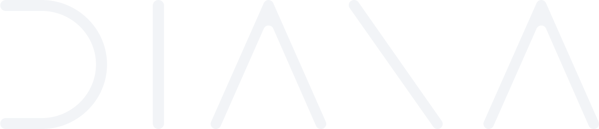
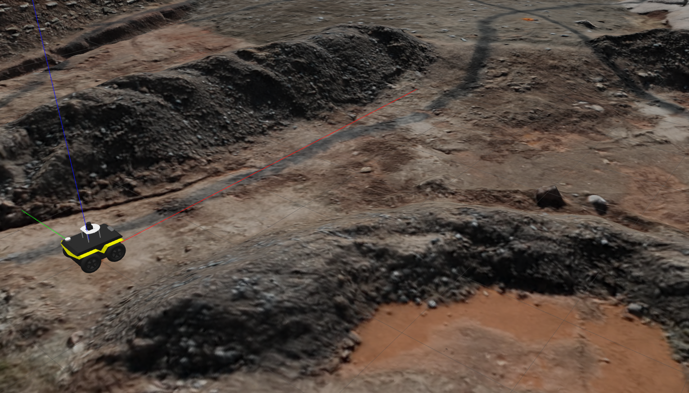
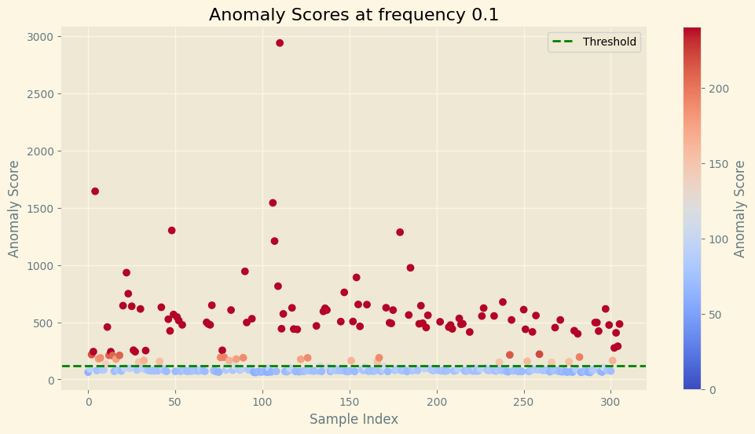

<h1 align="center">Federico Mustich</h1>

  <h3 align="left"> AI and Space Robotics</h3>

<!-- -->

I am Federico Mustich, (aka @HalfARobot, @H4R or @Anatr1), a Computer Engineer from Italy. I am currently <strong>head of the AI Group at <a href="https://github.com/team-diana">DIANA</a></strong>, a space robotics student team from <a href="https://www.polito.it/">Politecnico di Torino</a> participating at student competitions and active in research and development of space robotics technologies. I am also a ML Researcher for the proposed <a href="https://wivern.polito.it/">WIVERN</a></strong> ESA Mission.

<!--

-->

&nbsp;

<h3 align="left">Languages and Tools:</h3>

              <a href="https://www.tensorflow.org" target="_blank" rel="noreferrer">   

<h3 align="left">Contacts:</h3>

  

